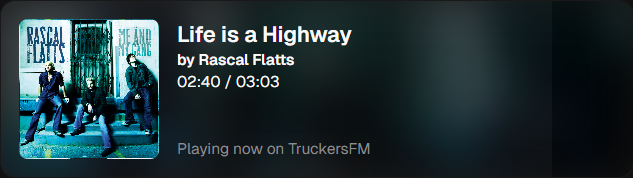
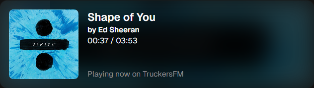

### TruckersFM Stream Overlay
Simple overlay for streamers listening to TruckersFM. Just add a browser source to your streaming software and you're good to go!

### Features
- Displays the current song and artist.
- Progress to the song end, if MusicBrainz is available.
  - Please note that this might sometimes be off by a few seconds. This can be due to many factors, including radio mixes and desync between the stream and the API. I've added a 10s buffer in the intermission timing to account for this.
- During intermissions displays the current DJ.

### Installation
1. Copy the following URL: `https://tfm.tumppi066.fi`
2. Add a new browser source in your streaming software.
3. Set `width` to `580px` and `height` to `170px`.
4. Done!

### Screenshots
Whatever is on [right now](https://tfm.tumppi066.fi)!





### FAQ
> Why do you not have a progress bar?

The TruckersFM API does not provide progress. We do have a spotify link but implementing that is too much work for what it's worth.

> Why does the song display during ads and talking?

That's what the API does. There is no break in the stream, we just get the current song and the start time.

> Why does it take some time to update?

To not overload the TFM servers. Every instance of the overlay is pinging them, so we only do it once every 10 seconds. That's already approaching the limit of what I'm comfortable with.

> Why the TruckersFM watermark?

Because you are playing music from TruckersFM. It's rude to not give them credit. I had the option of going for the logo or the text, and I chose the text since it's less intrusive.

> Do you need credit?

Not if you don't want to. I'm totally fine with streamers not crediting at all. If you are going to make a fork for your own changes then I would appreciate a mention there.

### How can I run this locally?
#### Install the webpage (first time only)
1. Clone the repository.
2. Install Node.js from https://nodejs.org/.
```bash
cd truckersfm-stream-overlay
npm i
```
#### Start the server
```bash
cd truckersfm-stream-overlay
npm start
```