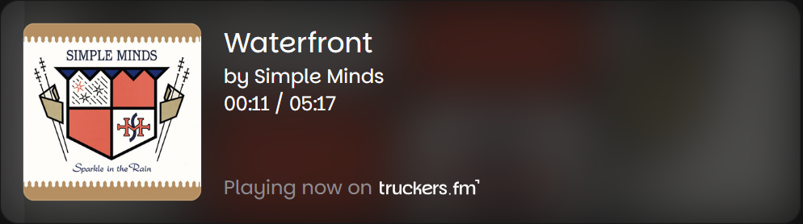

### TruckersFM Stream Overlay
Simple overlay for streamers listening to TruckersFM. Just add a browser source to your streaming software and you're good to go!

### Features
- Displays the current song and artist.
- Progress display (other overlays don't have this!).
  - Please note that this might sometimes be off by a few seconds. This can be due to many factors, including radio mixes and desync between the stream and the API
  - Uses the free MusicBrainz API to get the song end time.
- During intermissions displays the current DJ.
- Adjustable scaling to fit all streaming software and canvas resolutions.

### Installation
1. Copy the following URL: `https://tfm.tumppi066.fi`
2. Add a new browser source in your streaming software with that URL.
3. *(Optional)* Set `width` to `580px` and `height` to `170px`.
4. *(Optional)* Adjust the scaling by adding `/?scale=1.0` to the URL, where `1.0` is the scale factor.
5. Done!

### Preview
Whatever is on [right now](https://tfm.tumppi066.fi)!



### FAQ
> Why is the song stop time off by a few seconds or minutes?

We use your PC's internal clock, you should check that it's synced to a satisfactory level. You can use https://time.is to check your offset. Any offset will directly translate to the progress bar being off!

> Why do some songs not have a progress bar?

The TruckersFM API does not provide progress. I've implemented a workaround that uses free and public APIs, all songs however are not correctly detected. It is what it is, unless TFM adds the song end time to the API there's not much I can do about it. 

> Why does the song display during ads and talking?

That's what the API does. There is no break in the stream, we just get the current song and the start time. I have implemented features to try and automatically detect intermissions. It's not 100% accurate though.

> Why does it take some time to update?

To not overload the TFM servers. Every instance of the overlay is pinging them, so we only do it once every 10 seconds. That's already approaching the limit of what I'm comfortable with.

> Why the TruckersFM watermark?

Because you are playing music from TruckersFM. It's rude to not give them credit. I had the option of going for the logo or the text, and I chose the text since it's less intrusive.

> Do you need credit?

Not if you don't want to. I'm totally fine with streamers not crediting at all. If you are going to make a fork for your own changes then I would appreciate a mention there.

> Why is the title not bold?

I follow the [TruckersFM brand guidelines](https://truckers.fm/brand-usage) that state all text should be in regular. That's all.

### How can I run this locally?
#### Install the webpage (first time only)
1. Clone the repository.
2. Install Node.js from https://nodejs.org/.
```bash
cd truckersfm-stream-overlay
npm i
```
#### Start the server
```bash
cd truckersfm-stream-overlay
npm start
```